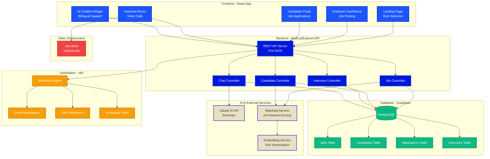

# 🏗️ Jale AI Hiring Assistant - Architecture Diagram

## 📊 Mermaid Diagram (Copy & Paste into https://mermaid.live/)



---

## 🎨 Visual Description for Excalidraw/Draw.io

### **Layout: Left to Right Flow**

#### **Column 1: Users**

```
┌─────────────────┐
│   👔 Employer   │
│  (Hiring Mgr)   │
└────────┬────────┘
         │
         v
┌─────────────────┐
│  👷 Job Seeker  │
│    (Worker)     │
└─────────────────┘
```

#### **Column 2: Frontend (React)**

```
┌──────────────────────────────┐
│     FRONTEND - React App     │
├──────────────────────────────┤
│ • Landing Page (Role Select) │
│ • Employer Dashboard         │
│ • Job Posting Form           │
│ • Candidate List             │
│ • Interview Scheduler        │
│ • Candidate Portal           │
│ • Application Form           │
│ • Interview Room (Jitsi)     │
│ • AI Chatbot Widget          │
└──────────────────────────────┘
         │
         │ HTTP/REST API
         │ (Axios)
         v
```

#### **Column 3: Backend (Node.js)**

```
┌──────────────────────────────┐
│   BACKEND - Express Server   │
│        Port: 5000            │
├──────────────────────────────┤
│ Controllers:                 │
│  • Job Controller            │
│  • Candidate Controller      │
│  • Interview Controller      │
│  • Chat Controller           │
│                              │
│ Services:                    │
│  • Matching Service (AI)     │
│  • Claude Service            │
│  • Notification Service      │
│  • Scheduling Service        │
└──────────────────────────────┘
         │
         ├───────────────┐
         │               │
         v               v
```

#### **Column 4: External Services**

**Top Box: AI Services**

```
┌──────────────────────────────┐
│      AI & ML SERVICES        │
├──────────────────────────────┤
│ • Claude AI (Anthropic)      │
│   - Chat responses           │
│   - Job matching             │
│   - Candidate screening      │
│                              │
│ • Embedding Service          │
│   - Text vectorization       │
│   - Semantic search          │
└──────────────────────────────┘
```

**Middle Box: Database**

```
┌──────────────────────────────┐
│   DATABASE - Supabase        │
│      (PostgreSQL)            │
├──────────────────────────────┤
│ Tables:                      │
│  📋 jobs                     │
│  👤 candidates               │
│  📄 applications             │
│  🎥 interviews               │
│  💬 chat_history             │
└──────────────────────────────┘
```

**Bottom Box: Automation**

```
┌──────────────────────────────┐
│    AUTOMATION - n8n          │
├──────────────────────────────┤
│ • Email Notifications        │
│ • SMS Reminders (Twilio)     │
│ • Scheduled Tasks            │
│ • Webhook Triggers           │
└──────────────────────────────┘
```

**Side Box: Video**

```
┌──────────────────────────────┐
│     VIDEO - Jitsi Meet       │
├──────────────────────────────┤
│ • Video Conferencing         │
│ • Audio Communication        │
│ • Screen Sharing             │
│ • No backend needed          │
└──────────────────────────────┘
```

---

## 🔄 Data Flow Examples

### **Example 1: Job Seeker Applies for Job**

```
1. Worker fills Application Form (Frontend)
   ↓
2. POST /applications (Backend API)
   ↓
3. Store in applications table (Supabase)
   ↓
4. Calculate match score (Claude AI)
   ↓
5. Trigger notification workflow (n8n)
   ↓
6. Send email to employer (n8n → SMTP)
```

### **Example 2: Employer Posts Job**

```
1. Employer fills Job Form (Frontend)
   ↓
2. POST /jobs (Backend API)
   ↓
3. Store in jobs table (Supabase)
   ↓
4. Generate embeddings (Embedding Service)
   ↓
5. Find matching candidates (AI Matching)
   ↓
6. Send notifications to matches (n8n)
```

### **Example 3: AI Chatbot Conversation**

```
1. Worker types question in ChatBot (Frontend)
   ↓
2. POST /chat (Backend API)
   ↓
3. Send to Claude AI (Anthropic API)
   ↓
4. Get AI response (bilingual support)
   ↓
5. Store chat history (Supabase)
   ↓
6. Return response (Frontend displays)
```

### **Example 4: Video Interview**

```
1. Interview scheduled (Frontend)
   ↓
2. POST /interviews (Backend API)
   ↓
3. Store interview details (Supabase)
   ↓
4. Send calendar invite (n8n)
   ↓
5. At interview time:
   - Frontend connects to Jitsi
   - Direct P2P video (no backend)
```

---

## 🛠️ Technology Stack Summary

| Layer             | Technology            | Purpose                   |
| ----------------- | --------------------- | ------------------------- |
| **Frontend**      | React 19.2            | User Interface            |
| **Routing**       | React Router 7        | Page Navigation           |
| **Styling**       | Tailwind CSS 3        | Design System             |
| **HTTP Client**   | Axios 1.12            | API Requests              |
| **Backend**       | Node.js + Express     | REST API Server           |
| **Database**      | Supabase (PostgreSQL) | Data Storage              |
| **AI/ML**         | Claude AI (Anthropic) | Chat, Matching, Screening |
| **Embeddings**    | Text Vectorization    | Semantic Search           |
| **Automation**    | n8n                   | Workflows, Notifications  |
| **Notifications** | Twilio (optional)     | SMS Reminders             |
| **Video**         | Jitsi Meet            | Video Interviews          |
| **Icons**         | Lucide React          | UI Icons                  |
| **Date Utils**    | date-fns              | Date Formatting           |

---

## 🎯 Key Features by Component

### **Frontend Components**

- ✅ Landing Page with Role Selection
- ✅ Employer Dashboard (Jobs, Candidates, Interviews)
- ✅ Job Posting Form with AI-powered matching
- ✅ Candidate List with filtering
- ✅ Interview Scheduler
- ✅ Candidate Portal (Browse & Apply)
- ✅ Application Form (Simple, no resume)
- ✅ Video Interview Room (Jitsi)
- ✅ Bilingual AI Chatbot (EN/ES)

### **Backend Services**

- ✅ RESTful API with Express
- ✅ Job CRUD operations
- ✅ Candidate management
- ✅ Application processing
- ✅ Interview scheduling
- ✅ AI-powered matching scores
- ✅ Chat with Claude AI
- ✅ Notification triggers

### **Database Schema (Supabase)**

- ✅ jobs (title, description, requirements, salary)
- ✅ candidates (name, skills, experience)
- ✅ applications (job_id, candidate_id, status, match_score)
- ✅ interviews (application_id, scheduled_time, jitsi_room)
- ✅ chat_history (user_id, message, response)

---

## 📝 How to Use This Diagram

### **Option 1: Mermaid Live Editor**

1. Go to https://mermaid.live/
2. Copy the mermaid code from the top
3. Paste into the editor
4. **Export** as PNG or SVG
5. Use in your presentation!

### **Option 2: Excalidraw**

1. Go to https://excalidraw.com/
2. Use the visual description above
3. Draw boxes and arrows
4. Add your brand colors:
   - Primary: #1B56FD
   - Secondary: #0118D8
   - Accent: #E9DFC3

### **Option 3: Draw.io**

1. Go to https://app.diagrams.net/
2. Use "Flowchart" or "AWS Architecture" template
3. Follow the layout description above
4. Export as PNG/PDF

---

## 🚀 For Your Hackathon Pitch

**Key Points to Highlight:**

1. **Full Stack** - React frontend + Node.js backend
2. **AI-Powered** - Claude AI for matching & chat
3. **Bilingual** - English & Spanish support
4. **Automation** - n8n workflows for notifications
5. **Video Interviews** - Integrated Jitsi Meet
6. **Scalable** - Supabase (PostgreSQL) database
7. **Modern Stack** - Latest React, Tailwind, Express

**One-Liner:**

> "Jale AI is a full-stack, AI-powered hiring platform that connects construction workers with employers through intelligent matching, bilingual support, and integrated video interviews."

---

Good luck with your hackathon! 🎉
