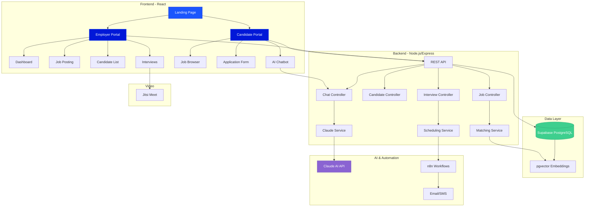

<div align="center">

# Jale AI Hiring Assistant

### Revolutionizing Blue-Collar Recruitment with AI

[](https://reactjs.org/)
[](https://nodejs.org/)
[](https://supabase.com/)
[](https://www.anthropic.com/)
[](https://tailwindcss.com/)
[](LICENSE)

[Features](#features) • [Demo](#demo) • [Tech Stack](#tech-stack) • [Quick Start](#quick-start) • [Architecture](#architecture) • [Contributing](#contributing)

---

</div>

## About

**Jale AI Hiring Assistant** is an intelligent recruitment platform designed specifically for blue-collar industries. Built for [Work4Workers](https://work4workers.com), it bridges the gap between employers and skilled workers through AI-powered matching, bilingual support, and automated workflows.

Built in 48 hours to solve real-world hiring challenges in the construction and trades industries.

## Features

<table>
<tr>
<td width="50%">

### AI-Powered Matching

- Intelligent candidate-job matching using vector embeddings
- Claude AI analyzes skills, experience, and requirements
- Real-time match scores (0-100%) with detailed breakdowns

### Bilingual Chatbot

- English & Spanish support for inclusive hiring
- Context-aware conversations about job opportunities
- 24/7 candidate assistance and application guidance

</td>
<td width="50%">

### Smart Scheduling

- Automated interview coordination
- Calendar integrations and reminders
- SMS/Email notifications via n8n workflows

### Video Interviews

- Built-in Jitsi Meet integration
- No downloads required - browser-based
- Recording capabilities for review

</td>
</tr>
</table>

### Additional Features

- **Real-time Dashboard** - Track applications, interviews, and hiring metrics
- **Advanced Filtering** - Sort candidates by match score, status, and skills
- **Mobile Responsive** - Works seamlessly on all devices
- **Custom Branding** - Tailored to Work4Workers' design system
- **Secure Data** - Supabase PostgreSQL with row-level security
- **Fast Performance** - Optimized React components and lazy loading

---

## Demo

<!-- Replace with actual screenshots when ready -->

<div align="center">

### Landing Page

_Role selection for employers and workers_


### Employer Dashboard

_Manage jobs, candidates, and interviews_


### Candidate Portal

_Browse jobs and apply with AI assistance_


</div>

---

## Tech Stack

<div align="center">

| Layer          | Technologies                                                            |
| -------------- | ----------------------------------------------------------------------- |
| **Frontend**   | React 19 • React Router 7 • Tailwind CSS 3 • Lucide Icons • date-fns    |
| **Backend**    | Node.js • Express • REST API • JWT Authentication                       |
| **Database**   | Supabase • PostgreSQL • pgvector (embeddings) • Real-time subscriptions |
| **AI/ML**      | Claude 3 (Anthropic) • Vector embeddings • Semantic search              |
| **Automation** | n8n • Email/SMS workflows • Calendar integrations                       |
| **Video**      | Jitsi Meet SDK • WebRTC • P2P conferencing                              |
| **Dev Tools**  | npm • PostCSS • Axios • ESLint • Git                                    |

</div>

---

## Quick Start

### Prerequisites

- Node.js 18+ and npm
- Supabase account ([Sign up free](https://supabase.com))
- Anthropic API key ([Get here](https://console.anthropic.com))
- n8n installed globally or via npx

### 1. Clone the Repository

```bash
git clone https://github.com/bssilva06/jale-hiring-assistant.git
cd jale-hiring-assistant
```

### 2. Install Dependencies

```bash
# Install frontend dependencies
cd frontend
npm install

# Install backend dependencies
cd ../backend
npm install
```

### 3. Environment Setup

**Frontend** (`frontend/.env.local`):

```env
REACT_APP_SUPABASE_URL=your_supabase_url
REACT_APP_SUPABASE_ANON_KEY=your_supabase_anon_key
REACT_APP_API_URL=http://localhost:5000
```

**Backend** (`backend/.env`):

```env
PORT=5000
SUPABASE_URL=your_supabase_url
SUPABASE_SERVICE_KEY=your_supabase_service_key
CLAUDE_API_KEY=your_claude_api_key
N8N_WEBHOOK_URL=your_n8n_webhook_url
```

**Note:** See `.env.example` files for full configuration options

### 4. Run the Application

**Terminal 1 - Frontend:**

```bash
cd frontend
npm start
# Opens at http://localhost:3000
```

**Terminal 2 - Backend:**

```bash
cd backend
npm run dev
# Runs at http://localhost:5000
```

**Terminal 3 - n8n (Optional):**

```bash
npx n8n
# Opens at http://localhost:5678
```

### 5. Access the App

- **Frontend**: [http://localhost:3000](http://localhost:3000)
- **Backend API**: [http://localhost:5000](http://localhost:5000)
- **n8n Dashboard**: [http://localhost:5678](http://localhost:5678)

---

## Architecture

<div align="center">



</div>

### Project Structure

```
jale-hiring-assistant/
├── frontend/              # React application
│   ├── src/
│   │   ├── components/      # Reusable UI components
│   │   ├── pages/           # Route pages
│   │   ├── services/        # API & Supabase clients
│   │   └── utils/           # Helper functions
│   └── public/              # Static assets
├── backend/               # Node.js API server
│   └── src/
│       ├── controllers/     # Route handlers
│       ├── services/        # Business logic
│       ├── middleware/      # Auth & error handling
│       └── routes/          # API endpoints
├── n8n-workflows/         # Automation workflows
│   └── exports/             # Workflow JSON exports
└── docs/                  # Documentation
    ├── API.md               # API documentation
    ├── ARCHITECTURE.md      # System design
    ├── SETUP.md            # Detailed setup guide
    └── DEMO_SCRIPT.md      # Presentation guide
```

---

## Documentation

| Document                                         | Description                             |
| ------------------------------------------------ | --------------------------------------- |
| [Quick Start](QUICK_START.md)                    | Get started in 3 steps                  |
| [Setup Guide](docs/SETUP.md)                     | Detailed installation and configuration |
| [API Reference](docs/API_REFERENCE.md)           | Complete API documentation              |
| [Frontend Guide](docs/FRONTEND.md)               | Frontend architecture and components    |
| [Component Library](docs/COMPONENTS.md)          | Visual component reference              |
| [Architecture Overview](docs/ARCHITECTURE_MERMAID.md) | System design with diagrams        |

---

## Design System

Built with Work4Workers' brand identity:

- **Primary Color**: `#1B56FD` (Bright Blue)
- **Secondary Color**: `#0118D8` (Deep Blue)
- **Accent Color**: `#E9DFC3` (Cream)
- **Light Background**: `#FFF8F8` (Off-White)
- **Font**: Inter (Google Fonts)

---

## Contributing

We welcome contributions. Here's how you can help:

1. Fork the repository
2. Create a feature branch (`git checkout -b feature/AmazingFeature`)
3. Commit your changes (`git commit -m 'Add some AmazingFeature'`)
4. Push to the branch (`git push origin feature/AmazingFeature`)
5. Open a Pull Request

---

## License

This project is licensed under the MIT License - see the [LICENSE](LICENSE) file for details.

---

## Team

- **Benjamin Silva** - Frontend Development
- **Jacob Luna** - Backend Development

---

## Acknowledgments

- [Work4Workers](https://work4workers.com) for the inspiration
- [Anthropic](https://www.anthropic.com) for Claude AI
- [Supabase](https://supabase.com) for the amazing backend platform
- [Jitsi](https://jitsi.org) for open-source video conferencing

---

<div align="center">

**Made for blue-collar workers**

[Report Bug](https://github.com/bssilva06/jale-hiring-assistant/issues) • [Request Feature](https://github.com/bssilva06/jale-hiring-assistant/issues)

</div>
