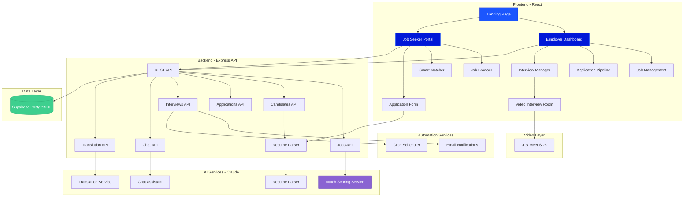

<div align="center">

# Jale AI Hiring Assistant

### Revolutionizing Blue-Collar Recruitment with AI

[](https://reactjs.org/)
[](https://nodejs.org/)
[](https://supabase.com/)
[](https://www.anthropic.com/)
[](https://tailwindcss.com/)
[](LICENSE)

[Features](#features) • [Tech Stack](#tech-stack) • [Quick Start](#quick-start) • [Architecture](#architecture) • [API](#api-endpoints)

---

</div>

## About

**Jale AI Hiring Assistant** is an intelligent recruitment platform designed specifically for blue-collar industries. Built for [Work4Workers](https://work4workers.com), it bridges the gap between employers and skilled workers through AI-powered matching, comprehensive bilingual support, and automated workflows.

**Hackathon Winner** - Built and enhanced to solve real-world hiring challenges in the construction, trades, and service industries.

## Features

### Core Features

<table>
<tr>
<td width="50%">

#### AI-Powered Smart Matching

- **Intelligent Matching Algorithm** with 120-point scoring system
  - Schedule matching (30 pts)
  - Skills matching (30 pts) with fuzzy keyword extraction
  - Pay range matching (25 pts)
  - Location matching (20 pts)
  - Field/industry matching (15 pts)
  - Experience bonus (up to 10 pts)
- Color-coded match scores with detailed reasoning
- Transparent "Why this is a great match" explanations
- Skills extracted from both job descriptions AND requirements

#### AI Resume Parsing

- **Drag-and-drop resume upload** (PDF, TXT, DOC, DOCX)
- Claude AI extracts structured data:
  - Contact information
  - Skills and certifications
  - Years of experience
  - Education level
- Auto-fills application forms
- 5MB file size support
- Real-time parsing status indicator

#### Bilingual Support (English/Spanish)

- **Full i18next integration** with persistent language preference
- **Auto-detecting chatbot** responds in user's language
- **Dynamic job translation** via Claude AI Translation API
- Comprehensive Spanish character detection
- All UI elements localized

</td>
<td width="50%">

#### Video Interviews with Feedback

- **Integrated Jitsi Meet** video conferencing
- No downloads required - browser-based
- In-app interview interface with candidate info sidebar
- **Post-interview feedback system**:
  - Hire/Maybe/Reject decisions
  - 5-star rating system
  - Interview notes
  - Automatic application status updates

#### Smart Scheduling & Automation

- Automated interview coordination
- **node-cron scheduled reminders** (24 hours before)
- Email notifications:
  - Application confirmations
  - Interview scheduled alerts
  - Automated reminders
- Nodemailer SMTP integration

#### AI Chat Assistant

- Context-aware job-specific conversations
- Bilingual language detection (en/es)
- Answers questions about:
  - Job requirements
  - Pay and benefits
  - Application process
  - Company details
- Limited scope to prevent spam

</td>
</tr>
</table>

### User Interfaces

#### For Employers

- **Comprehensive Dashboard** - Overview statistics, recent applications, active jobs
- **Job Management** - Create, edit, and delete job postings with status tracking
- **Application Pipeline** - Filter by match quality (High/Medium/Low) and status
- **Detailed Application View** - Match scores, candidate profiles, interview feedback
- **Interview Manager** - Schedule, track, and join video interviews with status badges
- **Smart Filtering** - Sort by match score, status, skills, and quality tiers

#### For Job Seekers

- **Job Browser** - Browse and apply with AI assistance
- **Smart Job Matcher** - Upload resume for AI-powered job recommendations
- **Application Form** - Auto-fill from resume or enter manually
- **Chatbot Widget** - Ask job questions in English or Spanish
- **Application Success** - Confirmation page with next steps

### Additional Features

- **Real-time Match Scoring** - Live calculation of candidate-job compatibility
- **Color-Coded Status Badges** - Visual indicators throughout the UI
- **Mobile Responsive** - Optimized for all devices
- **Custom Branding** - Work4Workers design system
- **Secure Data** - Supabase PostgreSQL with structured schemas
- **Fast Performance** - Optimized React components with lazy loading
- **Interview Timeline** - Track application progress from submission to hire

---

## Tech Stack

<div align="center">

| Layer            | Technologies                                                                |
| ---------------- | --------------------------------------------------------------------------- |
| **Frontend**     | React 19 • React Router 7 • Tailwind CSS 3 • Lucide Icons • i18next        |
| **Backend**      | Node.js • Express • REST API • Multer (file uploads)                        |
| **Database**     | Supabase • PostgreSQL • Real-time subscriptions                             |
| **AI/ML**        | Claude 3 Haiku (Anthropic) • Resume parsing • Translation • Chatbot         |
| **Automation**   | Nodemailer • node-cron • Automated reminders                                |
| **Video**        | Jitsi Meet React SDK • WebRTC • Browser-based conferencing                  |
| **Dev Tools**    | npm • Axios • date-fns • CORS • dotenv                                      |

</div>

---

## Quick Start

### Prerequisites

- Node.js 18+ and npm
- Supabase account ([Sign up free](https://supabase.com))
- Anthropic API key ([Get here](https://console.anthropic.com))

### 1. Clone the Repository

```bash
git clone https://github.com/bssilva06/jale-hiring-assistant.git
cd jale-hiring-assistant
```

### 2. Install Dependencies

```bash
# Install frontend dependencies
cd frontend
npm install

# Install backend dependencies
cd ../backend
npm install
```

### 3. Environment Setup

**Frontend** (`frontend/.env.local`):

```env
REACT_APP_SUPABASE_URL=your_supabase_url
REACT_APP_SUPABASE_ANON_KEY=your_supabase_anon_key
REACT_APP_API_URL=http://localhost:5000
```

**Backend** (`backend/.env`):

```env
PORT=5000
SUPABASE_URL=your_supabase_url
SUPABASE_SERVICE_KEY=your_supabase_service_key
CLAUDE_API_KEY=your_claude_api_key

# Email configuration (optional - for notifications)
EMAIL_HOST=smtp.gmail.com
EMAIL_PORT=587
EMAIL_USER=your_email@gmail.com
EMAIL_PASSWORD=your_app_password
EMAIL_FROM=noreply@yourcompany.com
EMAIL_SECURE=false
```

**Note:** See `.env.example` file for additional configuration options

### 4. Run the Application

**Terminal 1 - Backend:**

```bash
cd backend
npm run dev
# Runs at http://localhost:5000
```

**Terminal 2 - Frontend:**

```bash
cd frontend
npm start
# Opens at http://localhost:3000
```

### 5. Access the App

- **Frontend**: [http://localhost:3000](http://localhost:3000)
- **Backend API**: [http://localhost:5000](http://localhost:5000)
- **Health Check**: [http://localhost:5000/health](http://localhost:5000/health)

---

## Architecture

<div align="center">



</div>

### Project Structure

```
jale-hiring-assistant/
├── frontend/              # React application
│   ├── src/
│   │   ├── components/      # Reusable UI components
│   │   │   ├── candidate/     # Job seeker components
│   │   │   ├── hiring/        # Employer components
│   │   │   ├── layout/        # Navigation & layout
│   │   │   └── shared/        # Shared components (Toast, LanguageSwitcher)
│   │   ├── contexts/        # React Context (Toast)
│   │   ├── pages/           # Route pages
│   │   ├── locales/         # i18next translation files (en/es)
│   │   ├── services/        # API & Supabase clients
│   │   ├── utils/           # Helper functions (translator)
│   │   ├── i18n.js          # i18next configuration
│   │   └── App.js           # Main app with routing
│   └── public/              # Static assets
├── backend/               # Node.js API server
│   └── src/
│       ├── controllers/     # Route handlers
│       ├── services/        # Business logic (Claude, scheduling, notifications)
│       ├── routes/          # API endpoints
│       └── server.js        # Express app entry point
├── .env.example           # Example environment variables
├── package.json           # Root package file
└── README.md              # This file
```

---

## API Endpoints

### Jobs

- `POST /api/jobs` - Create new job posting
- `GET /api/jobs` - Retrieve all jobs
- `GET /api/jobs/:id` - Get specific job details
- `GET /api/jobs/:id/applications` - Get all applications for a job
- `PUT /api/jobs/:id` - Update job posting
- `DELETE /api/jobs/:id` - Soft delete job
- `DELETE /api/jobs/:id?permanent=true` - Permanently delete job

### Candidates & Applications

- `POST /api/candidates` - Create candidate application
- `GET /api/candidates` - Get all candidates
- `GET /api/candidates/:id` - Get specific candidate
- `GET /api/candidates/:candidate_id/match/:job_id` - Calculate match score
- `POST /api/candidates/parse-resume` - Parse resume text
- `POST /api/candidates/parse-resume-file` - Parse uploaded resume file (PDF/TXT/DOC/DOCX)
- `GET /api/applications` - Get all applications (filterable by job_id)
- `GET /api/applications/:id` - Get specific application
- `PATCH /api/applications/:id/status` - Update application status
- `DELETE /api/applications/:id` - Delete application

### Interviews

- `POST /api/interviews` - Schedule new interview
- `GET /api/interviews` - Get all interviews
- `GET /api/interviews/:id` - Get specific interview with full details
- `GET /api/interviews/candidate/:candidate_id` - Get all interviews for a candidate
- `PUT /api/interviews/:id` - Update interview (decision/feedback)
- `POST /api/interviews/:id/cancel` - Cancel interview

### AI Services

- `POST /api/chat` - Send message and get AI chatbot response (bilingual)
- `GET /api/chat/:job_id/:candidate_id` - Retrieve chat conversation history
- `POST /api/translate` - Translate text between languages (en/es)

### Health Check

- `GET /health` - Server health status

---

## Key Features Explained

### 1. Smart Matching Algorithm

The matching algorithm uses a 120-point system (capped at 100%) that evaluates:

- **Schedule Match (30 points)**: Checks both `job_type` and `schedule` fields
- **Skills Match (30 points)**: Keyword extraction with fuzzy matching
- **Pay Match (25 points)**: Range comparison with flexibility
- **Location Match (20 points)**: Substring matching
- **Field Match (15 points)**: Job title and description analysis
- **Experience Bonus (up to 10 points)**: Year requirements extraction

Match scores are color-coded:
- Green (80%+): Excellent match
- Yellow (60-79%): Good match
- Orange (<60%): Potential match

### 2. AI Resume Parsing

Upload a resume and Claude AI extracts:
- Contact information (name, email, phone)
- Skills array
- Experience years (numeric)
- Certifications array
- Education level
- Language preference

The parsed data automatically populates the application form.

### 3. Bilingual Chat Assistant

The chatbot:
- Detects language automatically (Spanish characters/keywords)
- Responds ONLY in the detected language
- Answers job-specific questions
- Maintains conversation context
- Uses low temperature (0.2) for consistent language output

### 4. Automated Interview Reminders

A cron job runs daily at 9:00 AM to:
- Check for interviews scheduled within 24 hours
- Send reminder emails to candidates
- Include meeting links and job details

---

## Design System

Built with Work4Workers' brand identity:

- **Primary Color**: `#1B56FD` (Bright Blue)
- **Secondary Color**: `#0118D8` (Deep Blue)
- **Accent Color**: `#E9DFC3` (Cream)
- **Light Background**: `#FFF8F8` (Off-White)
- **Font**: Inter (Google Fonts)
- **Match Score Colors**:
  - Green: `#10B981` (High match)
  - Yellow: `#F59E0B` (Medium match)
  - Orange: `#EF4444` (Low match)

---

## Contributing

We welcome contributions! Here's how you can help:

1. Fork the repository
2. Create a feature branch (`git checkout -b feature/AmazingFeature`)
3. Commit your changes (`git commit -m 'Add some AmazingFeature'`)
4. Push to the branch (`git push origin feature/AmazingFeature`)
5. Open a Pull Request

---

## License

This project is licensed under the MIT License - see the [LICENSE](LICENSE) file for details.

---

## Team

- **Benjamin Silva** - Frontend Development
- **Jacob Luna** - Backend Development

---

## Acknowledgments

- [Work4Workers](https://work4workers.com) for the inspiration and partnership
- [Anthropic](https://www.anthropic.com) for Claude AI capabilities
- [Supabase](https://supabase.com) for the powerful backend platform
- [Jitsi](https://jitsi.org) for open-source video conferencing

---

<div align="center">

**Made with care for blue-collar workers**

Built to empower Latino workers and employers in construction, trades, and service industries.

[Report Bug](https://github.com/bssilva06/jale-hiring-assistant/issues) • [Request Feature](https://github.com/bssilva06/jale-hiring-assistant/issues)

</div>
