# Jale AI Hiring Assistant - Mermaid Architecture Diagrams

## 🏗️ System Architecture Overview

```mermaid
graph TB
    subgraph "Frontend - React App (Port 3000)"
        A[Employer Portal]
        B[Candidate Portal]
        C[Shared Components]

        A --> A1[Dashboard]
        A --> A2[Job Posting Form]
        A --> A3[Active Jobs]
        A --> A4[Applications]
        A --> A5[Interview Scheduler]
        A --> A6[Interview Room]

        B --> B1[Job Matcher]
        B --> B2[Application Form]
        B --> B3[Interview Room]
        B --> B4[AI Chatbot]

        C --> C1[Navbar]
        C --> C2[Button]
        C --> C3[Card]
        C --> C4[Modal]
    end

    subgraph "Backend - Node.js + Express (Port 5000)"
        D[API Routes]
        E[Services]
        F[Controllers]

        D --> D1[/api/jobs]
        D --> D2[/api/candidates]
        D --> D3[/api/applications]
        D --> D4[/api/interviews]
        D --> D5[/api/chat]

        E --> E1[Claude AI Service]
        E --> E2[Notification Service]
        E --> E3[Scheduling Service]

        F --> F1[Job Controller]
        F --> F2[Candidate Controller]
        F --> F3[Interview Controller]
    end

    subgraph "Database - Supabase PostgreSQL"
        G[Tables]

        G --> G1[jobs]
        G --> G2[candidates]
        G --> G3[applications]
        G --> G4[interviews]
    end

    subgraph "External Services"
        H[Claude 3 Haiku]
        I[Gmail SMTP]
        J[Jitsi Meet]
    end

    A --> D
    B --> D
    D --> F
    F --> E
    F --> G
    E --> H
    E --> I
    A6 --> J
    B3 --> J
    E1 --> H

    style A fill:#e1f5ff
    style B fill:#fff4e1
    style D fill:#f0f0f0
    style E fill:#e8f5e9
    style G fill:#fce4ec
    style H fill:#fff3e0
    style I fill:#fff3e0
    style J fill:#fff3e0
```

---

## 📊 Database Schema & Relationships


---

## 🔄 Application Flow with Resume Upload


---

## 🎯 Job Matching Algorithm Flow


---

## 🤖 AI Match Scoring Process


---

## 📅 Interview Scheduling Flow


---

## 💬 Chatbot Interaction Flow


---

## 🔐 Authentication & Authorization (Future)


---

## 📈 Data Analytics Dashboard (Future)


---

## 🚀 Deployment Pipeline

```mermaid
flowchart TD
    Dev[Local Development] --> Git[Git Commit & Push]
    Git --> GitHub[GitHub Repository]

    GitHub --> CI{CI/CD Pipeline}

    CI --> Test1[Run Tests]
    CI --> Test2[Lint Code]
    CI --> Test3[Build Frontend]
    CI --> Test4[Build Backend]

    Test1 --> Pass{All Pass?}
    Test2 --> Pass
    Test3 --> Pass
    Test4 --> Pass

    Pass -->|Yes| Deploy{Deploy Stage}
    Pass -->|No| Fail[❌ Deployment Failed]

    Deploy --> FE[Deploy Frontend]
    Deploy --> BE[Deploy Backend]

    FE --> Vercel[Vercel/Netlify]
    BE --> Railway[Railway/Heroku/Render]

    Vercel --> CDN[CDN Distribution]
    Railway --> Server[Production Server]

    CDN --> Live[✅ Live Production]
    Server --> Live

    Live --> Monitor[Monitoring & Logs]
    Monitor --> Alert{Issues?}

    Alert -->|Yes| Rollback[Rollback to Previous]
    Alert -->|No| Success[✅ Deployment Complete]

    Rollback --> GitHub

    style Dev fill:#e1f5ff
    style Pass fill:#fff9c4
    style Live fill:#c8e6c9
    style Success fill:#c8e6c9
    style Fail fill:#ffcdd2
    style Rollback fill:#ffe0b2
```



---

## 🎨 Component Hierarchy


---

**Generated:** October 25, 2025  
**Version:** 2.0 - Complete Mermaid Diagrams  
**Project:** Jale AI Hiring Assistant
